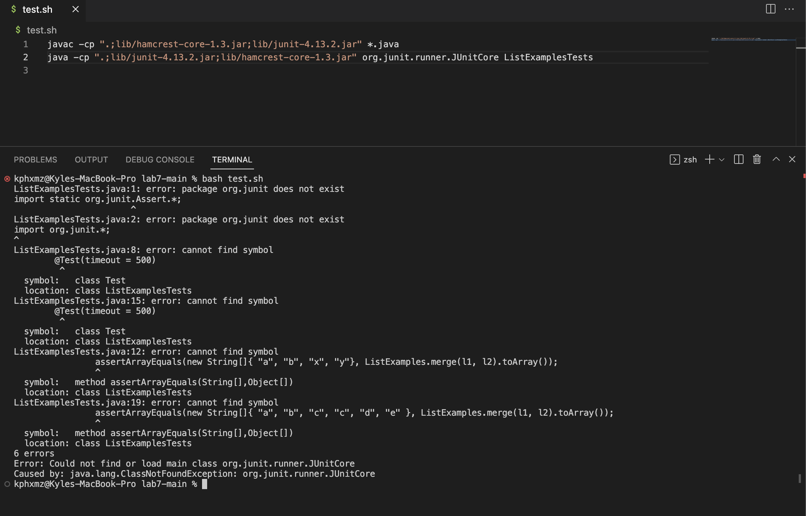

# Lab Report 5

## Part 1

Student Post: 

Hi I am currently using a Mac device with Safari as my main browswer. I am having a difficult time wondering why my tests will not run. I tried to run the tests using the test.sh script, but the JUunit is not detected as a package.

TA Response:

In looking through your test.sh file, it looks like you using the commands for Windows users. Try going back to Week 3 and use the commands that is designed for your Mac OS. The commands you should use is named under "Mac Users:"

