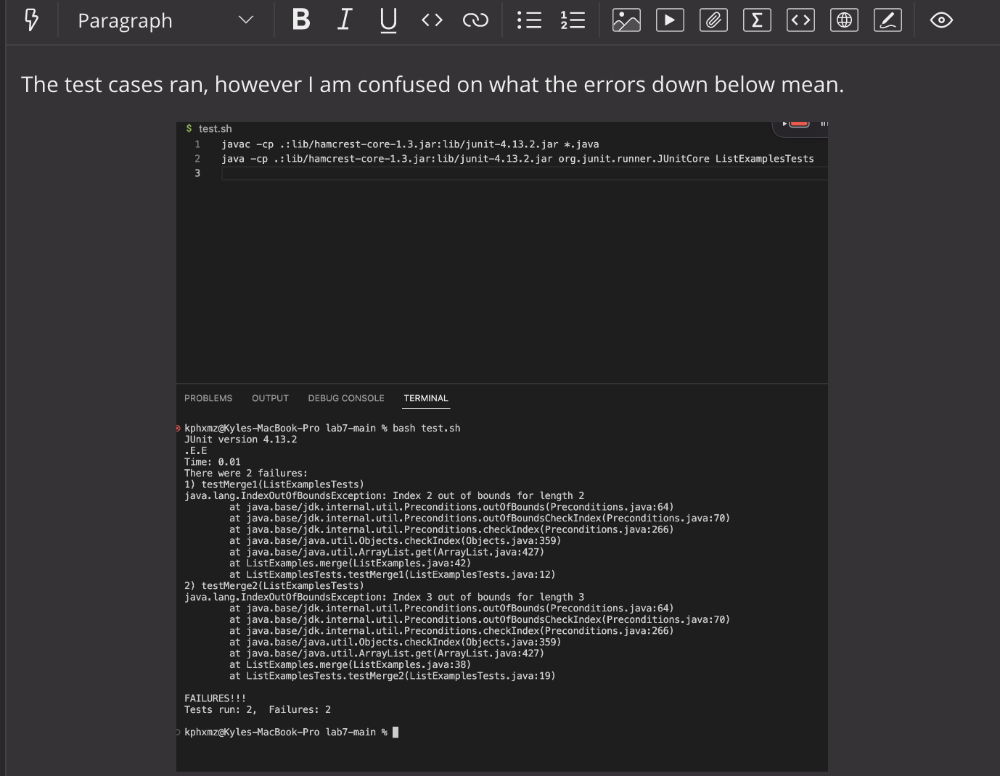

# Lab Report 5

## Part 1: Debugging Scenario

Student Post: 


TA Response:


Student Response:



TA Response:


Student Response:


## End of Part 1:
* The file and directory structure needed was from week 7 lab, which contained the files of ListExamples.java, ListExamplesTests.java, test.sh, and the jUnit files.
* Contents of each file before fixing the bug:


The full command line (or lines) you ran to trigger the bug: 
* `bash test.sh <enter>`

Description of what I used to fix the bugs:
* To fix the first bug of running the test cases, I needed to change the Windows OS commands from: 
* `javac -cp ".;lib/hamcrest-core-1.3.jar;lib/junit-4.13.2.jar" *.java` 
* `java -cp ".;lib/junit-4.13.2.jar;lib/hamcrest-core-1.3.jar" org.junit.runner.JUnitCore ListExamplesTests` 
to the Mac OS commands:
* `javac -cp .:lib/hamcrest-core-1.3.jar:lib/junit-4.13.2.jar *.java`
* `java -cp .:lib/hamcrest-core-1.3.jar:lib/junit-4.13.2.jar org.junit.runner.JUnitCore ListExamplesTests`

Then in ListExamples.java file, I changed the two last while loops which had errors in the index incrementation.
* First was `while(index2 < list1.size()) {` to `while(index1 < list1.size()) {` then `index2 += 1;` to `index1 += 1;`
* Next was `while(index1 < list2.size()) {` to `while(index2 < list2.size()) {` then `index1 += 1;` to `index2 += 1;`

The code should look like this now:
```
while(index1 < list1.size()) {
      result.add(list1.get(index1));
      index1 += 1;
    }
    while(index2 < list2.size()) {
      result.add(list2.get(index2));
      // change index1 below to index2 to fix test
      index2 += 1;
    }
    return result;
  }
  ```
* After doing these changes the test cases should now run perfectly fine, like in the image below.


## Part 2: Reflection
* In my second half of this spring quarter of being in CSE 15L, I learned many techniques that could be utilized. However I am only going to be talking about the bash script and the use of vim in a server. First, using the creation and application of the bash script. With this command, it makes it easier to  write commands since we can quickly send out an entire series of commands by typing `bash <file.sh>` instead of going through a hassle of typing out the commands in our terminal. Another thing I felt was useful, was the use of `vim` in a server. Using `vim` allowed me to edit a file within the terminal accessing the file and being able to make changes whenever needed to. Lastly, I realized how tedious and specific we must be in our lab reports. Explaning each step specifically and carefully to ensure we do not get any points marked off. I got many points marked off due to not being detailed and specific, but this ensures me to make sure I do in the near future.
