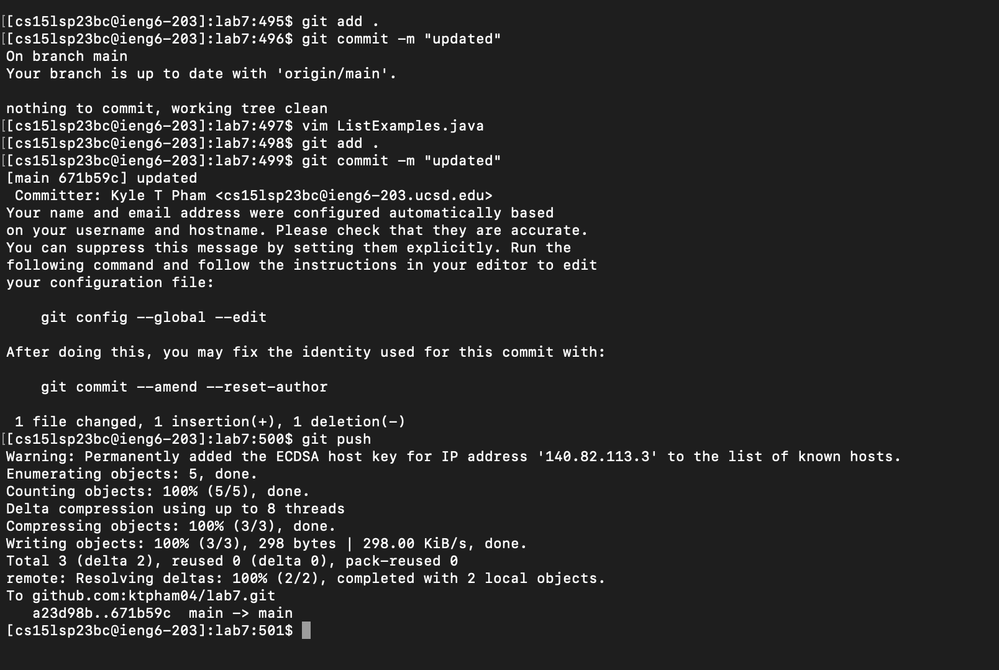

# Lab Report 4: Git and GitHub using Terminal & Vim

## Step 1: Logging on to IENG6
With using the ssh key made from lab 7, we are able to log into ieng6 without needing to use a password. In order to log in, we used `ssh cse15lsp23bc@ieng6.ucsd.edu`


## Step 2: Cloning Lab 7 Repo
We used `git clone` and the link from ssh lab 7 repo into our terminal. To clone lab 7, `git clone git@github.com:ktpham04/lab7.git`


## Step 3: Running Failed Test
After cloning lab 7 repo, we must run the tests with the given commands: ` cd lab7 <enter> javac -cp .:lib/hamcrest-core-1.3.jar:lib/junit-4.13.2.jar *.java <enter> java -cp .:lib/hamcrest-core-1.3.jar:lib/junit-4.13.2.jar org.junit.runner.JUnitCore ListExamplesTests <enter>` which will give you the output in the image below.


As you can see, once running these commands we are given 2 failed tests
The errors we had was in the file of `ListExamples.java`, in order to fix these errors we had to used the following keys `vim ListExamples.java <enter>` which takes our terminal to vim and show us the following code


## Step 4: Fix the code
Given the following code, we must change the last code 
To change the code, we must use the command: `vim ListExamples.java <enter>` which takes our terminal to vim and lets us to edit. In Vim, we used the keys: `<i>` to enter insert mode and `<h><h>...<h>` to go from the start of the page to the last while loop towards the end of the page within the ListExamples.java file.
```
while (index2 < list2.size()) {
result.add(list2.get (index2)) ;
// change index1 below to index2 to fix test
index1 += 1;
}
return result;
```
to
```
while (index2 < list2.size()) {
result.add(list2.get (index2)) ;
// change index1 below to index2 to fix test
index2 += 1;
}
return result;
```
After changing the code, we must save and quit vim by using the commands: `<esc> <:wq> <enter>` after doing so the test should now work.

## Step 5: Run Test Successfully
Once you changed the code you now want to run it again with this command: `java -cp .:lib/hamcrest-core-1.3.jar:lib/junit-4.13.2.jar org.junit.runner.JUnitCore ListExamplesTests <enter>`
Which will give you the output in the image below


## Step 6: Commit & Push
In order to commit we must use the command `git add . <enter` then `git commit -m "updated" <enter>`
After using these two commands, it will give you the output in the image below



Next you would want to push, using the command `git push <enter>` and now should be all set and done
